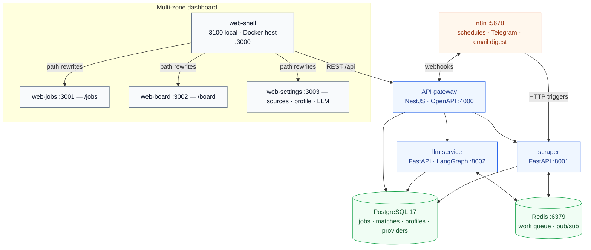

# Job Hunter

Personal job-search automation platform: monitors Ukrainian and remote boards
(**work.ua**, **job.ua**, **dou.ua**, **Upwork**, **Reddit**), normalizes and
scores postings with LLMs, and surfaces everything in a multi-zone Next.js
dashboard with Telegram and e-mail notifications.

Built as a **polyglot monorepo of microservices** (Python scraper/LLM, NestJS
API gateway) plus **multi-zone micro-frontends** (shell + jobs / board /
settings remotes). Clean Architecture in every service; hot-switchable LLM
providers (local Ollama, Ollama Cloud, OpenAI-compatible endpoints, Anthropic).

## What it does

1. **Scrape** — n8n (or the Sources page) triggers adapters; fetch ladder is
   API/RSS → crawl4ai (static HTML) → agent-browser (JS-heavy). Results are
   deduped and stored with scrape provenance.
2. **Process** — a Redis-backed LangGraph pipeline normalizes each posting,
   summarizes + tags + flags risks, matches against your active profile
   (0–100 score), and optionally drafts a cover letter for high scores.
3. **Triage** — filter, score, and react to vacancies in the dashboard; track
   application stages on a kanban board; get Telegram pushes and a daily e-mail
   digest via n8n.

## Features

### Dashboard (multi-zone Next.js)

One browser origin (`web-shell`) composes three remotes via path rewrites — not
Module Federation, not iframes.

| Area                               | App            | What you get                                                                                                                                          |
| ---------------------------------- | -------------- | ----------------------------------------------------------------------------------------------------------------------------------------------------- |
| **Jobs** (`/jobs`)                 | `web-jobs`     | Dense filterable table: source, tags, score, salary, remote, full-text, date range, reaction stage; detail drawer; permanent delete with confirmation |
| **Board** (`/board`)               | `web-board`    | Kanban: saved → applied → interview → offer / rejected (drag-and-drop + keyboard)                                                                     |
| **Sources** (`/sources`)           | `web-settings` | Enable/disable sources, trigger scrapes, run history, reconciliation                                                                                  |
| **Dictionaries** (`/dictionaries`) | `web-settings` | Editable keyword sets that drive scraper queries — no redeploy                                                                                        |
| **Profile** (`/profile`)           | `web-settings` | Skills, seniority, salary expectations, preferences used by the matcher                                                                               |
| **LLM settings** (`/settings/llm`) | `web-settings` | Add/test providers, pick models, hot-switch active provider, per-pipeline overrides                                                                   |

Also: EN + UA i18n, dark/light + design-mode themes, keyboard shortcuts for
triage, bulk reaction and bulk-delete, dead-letter / reconciliation views.

### Scraping & LLM

- Source adapters behind a shared `SourceAdapter` port; DOU / Work.ua / Job.ua
  share a static-HTML lifecycle; Reddit uses the public JSON API; Upwork is
  **best-effort** (see [docs/SOURCES.md](docs/SOURCES.md)).
- LangGraph pipelines: normalize/extract → summarize + tags + red flags →
  profile match → cover-letter draft (threshold-gated).
- Provider hub reads `llm_providers` from Postgres; switch from the dashboard
  without restarting workers (`LISTEN/NOTIFY` + short TTL cache).

### Notifications

- n8n owns schedules, Telegram bot delivery, and the daily e-mail digest.
- Workflows are versioned under `n8n/workflows/` and call HTTP endpoints only —
  no business logic in n8n.

## Tools & technologies

| Layer         | Stack                                                                                           |
| ------------- | ----------------------------------------------------------------------------------------------- |
| Monorepo      | Node.js ≥ 22, npm workspaces, Turborepo                                                         |
| Web UI        | Next.js 16, React 19, next-intl, TanStack Query/Table/Virtual, Tailwind 4, Vitest, Playwright   |
| Shared UI/API | `@job-hunter/web-ui`, `@job-hunter/web-api`, `@job-hunter/shared-ts` (OpenAPI-generated client) |
| API gateway   | NestJS, TypeScript, OpenAPI, Vitest, supertest                                                  |
| Scraper / LLM | FastAPI, Python (uv), LangGraph, ruff, mypy --strict, pytest                                    |
| Data / infra  | PostgreSQL 17, Redis, dbmate (SQL migrations), Docker Compose                                   |
| Automation    | n8n                                                                                             |
| Quality / git | ESLint, Prettier, Husky, lint-staged, Conventional Commits                                      |
| Agent context | OpenSpec, llm-wiki (`wiki/`), graphify                                                          |

## Methodologies

- **Clean Architecture** per service: `presentation → application → domain ← infrastructure`; domain has zero framework imports.
- **Microservices**: independently deployable processes with OpenAPI (or HTTP health) contracts; schema-per-concern in Postgres (`core.*`, `scraper.*`, `llm.*`); no cross-service table access.
- **Micro-frontends**: independently deployable Next apps behind `web-shell` via **multi-zone path rewrites** + unique `assetPrefix` per remote. Shared primitives live in packages. **Not** Module Federation; **not** iframes.
- **OpenSpec** for significant product/architecture changes (`openspec/changes/`).
- **llm-wiki + graphify** for session restore and codebase navigation.

## Architecture at a glance



Browser hits one origin (`web-shell`); remotes are separate Next apps composed by path rewrites — not Module Federation, not iframes.
Full details: [docs/ARCHITECTURE.md](docs/ARCHITECTURE.md) ·
[docs/DATA_MODEL.md](docs/DATA_MODEL.md) · [docs/SOURCES.md](docs/SOURCES.md) ·
[docs/LLM_CONFIG.md](docs/LLM_CONFIG.md) · [docs/DECISIONS.md](docs/DECISIONS.md) ·
[docs/DEPLOYMENT.md](docs/DEPLOYMENT.md) · [docs/UI_DESIGN.md](docs/UI_DESIGN.md) ·
[wiki/pages/current-state.md](wiki/pages/current-state.md)

## Screenshots

Product screenshots are not checked into this repository yet. The dashboard UI
is specified in [docs/UI_DESIGN.md](docs/UI_DESIGN.md). If you capture local
screenshots later, a conventional place is `docs/images/`.

## Repository layout (monorepo)

```
job-hunter/
├─ apps/
│  ├─ web-shell/      # Next.js host — multi-zone rewrites, Playwright e2e
│  ├─ web-jobs/       # Jobs remote (:3001, assetPrefix /jobs-static)
│  ├─ web-board/      # Board remote (:3002, assetPrefix /board-static)
│  ├─ web-settings/   # Settings remote (:3003, assetPrefix /settings-static)
│  └─ api/            # NestJS API gateway
├─ services/
│  ├─ scraper/        # FastAPI — source adapters
│  └─ llm/            # FastAPI — LangGraph + provider hub
├─ packages/
│  ├─ shared-ts/      # OpenAPI-generated TS client + shared types
│  ├─ web-ui/         # shared UI primitives
│  └─ web-api/        # shared browser/server API client + query keys
├─ n8n/workflows/
├─ infra/             # docker-compose.yml, dbmate migrations
├─ openspec/          # change proposals / specs
├─ docs/
└─ wiki/              # LLM-maintained session-context wiki
```

## Prerequisites

| Dependency        | Notes                                                                           |
| ----------------- | ------------------------------------------------------------------------------- |
| Node.js ≥ 22      | npm workspaces (`apps/*`, `packages/*`) + Turborepo                             |
| Python ≥ 3.12     | `services/scraper` and `services/llm` via [uv](https://github.com/astral-sh/uv) |
| Docker            | Redis (required); optional full Compose stack                                   |
| PostgreSQL 17     | Database `jobhunter`                                                            |
| n8n               | Schedules + Telegram/e-mail                                                     |
| agent-browser CLI | Optional fallback for JS-heavy pages                                            |

## Quick start

```bash
cp .env.example .env                                # fill in secrets
docker compose -f infra/docker-compose.yml up -d redis
npm install && npm run db:up                        # migrate schema (dbmate)

# API gateway
npm run dev -w apps/api

# Multi-zone UI (shell :3100 + remotes :3001–3003)
npm run dev:mfe

# Python services (separate terminals; prefer WSL/Linux or Docker on Windows)
cd services/llm && uv sync && uv run uvicorn llm.main:app --port 8002 --reload
cd services/scraper && uv sync && uv run uvicorn scraper.main:app --port 8001 --reload
```

| Surface                         | URL                                                                          |
| ------------------------------- | ---------------------------------------------------------------------------- |
| Dashboard (shell)               | http://localhost:3100 (Docker Compose maps host **:3000** → shell **:3100**) |
| API gateway                     | http://localhost:4000/v1 (Swagger at `/api`)                                 |
| Jobs / board / settings remotes | :3001 / :3002 / :3003 (normally reached via the shell)                       |
| n8n                             | http://localhost:5678                                                        |
| Scraper                         | http://localhost:8001                                                        |
| LLM service                     | http://localhost:8002                                                        |

Full install, env files, Compose profile, LLM providers, n8n import, and
**GitHub Actions CI**: **[docs/DEPLOYMENT.md](docs/DEPLOYMENT.md)**.

### Typical usage after boot

1. Open **LLM settings** and confirm an active provider (e.g. local Ollama).
2. Edit **Dictionaries** and **Profile** so scrapes and matching match your search.
3. On **Sources**, enable boards and trigger a scrape (or let n8n cron do it).
4. Triage on **Jobs** / **Board**; high-score matches can notify via Telegram.

## Quality bar

- **Clean Architecture** in every service.
- **TS**: strict mode, ESLint + Prettier, Vitest (api + remotes), Playwright e2e via `apps/web-shell`.
- **Python**: ruff, mypy strict, pytest + coverage on domain/application.
- **Contracts**: OpenAPI; TS client generated in `packages/shared-ts`, never hand-written.
- Conventional Commits; Husky + lint-staged.

See [docs/CODING_STANDARDS.md](docs/CODING_STANDARDS.md). CI:
[`.github/workflows/ci.yml`](.github/workflows/ci.yml).

## Status

Phases 0–7 are complete. Web UI is the multi-zone shell + remotes (monolith
`apps/web` retired). Day-to-day log: [PROGRESS.md](PROGRESS.md). Agent restore:
[wiki/pages/current-state.md](wiki/pages/current-state.md).
